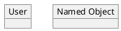
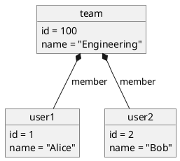
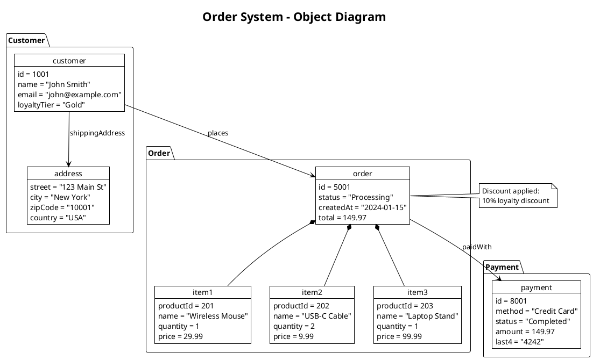
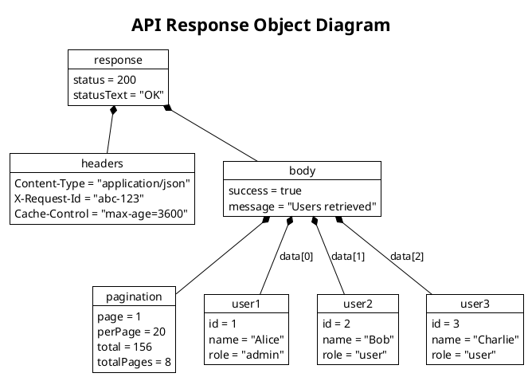
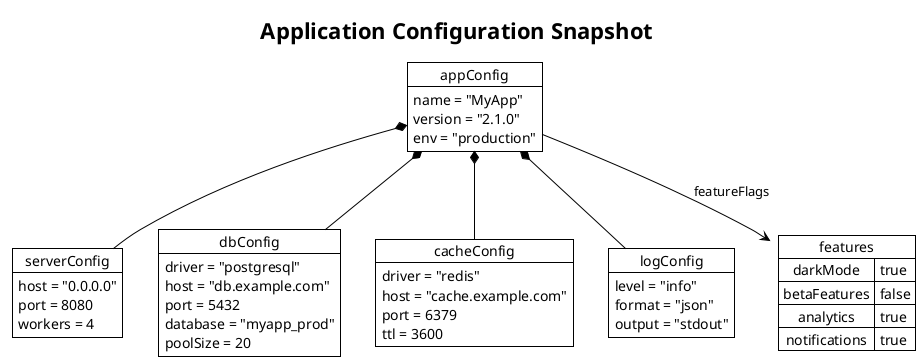
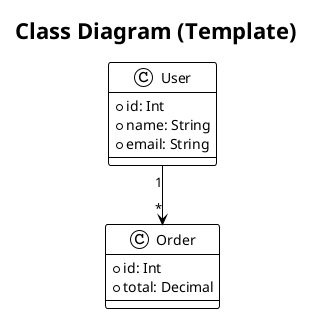
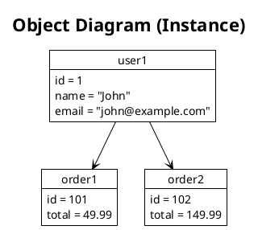

# PlantUML Object Diagram Reference

## Basic Object



## Object with Fields

```plantuml
object user {
  id = 123
  name = "John Doe"
  email = "john@example.com"
  active = true
}
```

## Field Types

```plantuml
object config {
  host = "localhost"
  port = 8080
  timeout = 30000
  debug = false
  tags = ["api", "v1"]
}
```

## Links Between Objects

### Basic Link

```plantuml
object user
object order
user --> order
```

### Labeled Link

```plantuml
object user
object order
user --> order : places
```

### Link Types

```plantuml
user --> order      ' Association
user o-- profile    ' Aggregation
user *-- session    ' Composition
user <|-- admin     ' Inheritance
```

## Multiple Objects



## Packages/Namespaces

```plantuml
package "User Domain" {
  object user {
    id = 1
    name = "John"
  }

  object profile {
    bio = "Developer"
    avatar = "img.png"
  }
}

package "Order Domain" {
  object order {
    id = 1001
    total = 99.99
  }
}

user --> order : places
user --> profile : has
```

## Map (Dictionary) Objects

```plantuml
map UserRoles {
  admin => Full access
  editor => Edit content
  viewer => Read only
}

map Config {
  host => localhost
  port => 8080
  env => production
}

object user {
  name = "John"
  role = "admin"
}

user --> UserRoles : has role
```

## JSON-like Structures

```plantuml
object request {
  method = "POST"
  path = "/api/users"
  headers = {
    "Content-Type": "application/json"
  }
  body = {
    "name": "John",
    "email": "john@example.com"
  }
}
```

## Notes

```plantuml
object user {
  name = "John"
}

note left of user
  Created from
  registration form
end note

note right of user : Active user

note "Floating note" as N1
user .. N1
```

## Colors and Styling

```plantuml
object active #lightgreen {
  status = "active"
}

object inactive #lightgray {
  status = "inactive"
}

object error #pink {
  status = "error"
}
```

## Skinparam

```plantuml
skinparam object {
  BackgroundColor #EFEFEF
  BorderColor #333333
  FontSize 12
}

skinparam objectArrow {
  Color #333333
}
```

## Complete Example: E-commerce Snapshot



## Complete Example: API Response



## Complete Example: Config Snapshot



## When to Use Object Diagrams

1. **Snapshot of System State** — Show concrete instances at a point in time
2. **Test Case Visualization** — Illustrate test data setup
3. **API Response Documentation** — Show example payloads
4. **Configuration Documentation** — Show concrete config values
5. **Debug Visualization** — Understand object relationships during debugging

## Comparison: Class vs Object




