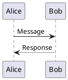

# PlantUML Sequence Diagram Reference

## Basic Syntax



## Participants

### Declaration

```plantuml
actor User
participant "Web App" as Web
boundary Controller
control Service
entity Repository
database Database
collections Workers
queue MessageQueue
```

### Order

```plantuml
participant Last order 30
participant Middle order 20
participant First order 10
```

### Styling

```plantuml
actor User #lightblue
participant "API" as API #pink
```

## Arrows

### Types

```plantuml
A -> B      # Solid line, solid head
A --> B     # Dotted line, solid head
A ->> B     # Solid line, thin head
A -->> B    # Dotted line, thin head
A ->x B     # Lost message
A <-> B     # Bidirectional
A ->o B     # Circle end
A o-> B     # Circle start
```

### Colors

```plantuml
A -[#red]> B: Error
A -[#green]> B: Success
A -[#0000FF]-> B: Blue dotted
```

## Messages

### Self-call

```plantuml
A -> A: Internal processing
```

### Return

```plantuml
A -> B: Request
return Response
```

### Async

```plantuml
A ->> B: Async call
```

## Activation (Lifelines)

### Explicit

```plantuml
activate A
A -> B: Call
activate B
B --> A: Response
deactivate B
deactivate A
```

### Shorthand

```plantuml
A -> B++: Call (activate B)
B --> A--: Response (deactivate B)

A -> B++: Call
B -> B: Process
return Response (deactivate + return)
```

### Nested

```plantuml
A -> B++: First
B -> B++: Nested
B --> B--: Done
B --> A--: Done
```

### Colors

```plantuml
A -> B++#gold: Activate with color
```

## Control Flow

### Alt/Else (Conditional)

```plantuml
alt Success
  A -> B: OK path
else Failure
  A -> B: Error path
else Timeout
  A -> B: Timeout path
end
```

### Opt (Optional)

```plantuml
opt Cache available
  A -> Cache: Get
  Cache --> A: Data
end
```

### Loop

```plantuml
loop Every minute
  A -> B: Heartbeat
end

loop 1000 times
  A -> B: Process item
end
```

### Par (Parallel)

```plantuml
par Thread 1
  A -> B: Task 1
also Thread 2
  A -> C: Task 2
also Thread 3
  A -> D: Task 3
end
```

### Break

```plantuml
break Error occurred
  A -> B: Handle error
end
```

### Critical

```plantuml
critical Transaction
  A -> DB: Begin
  A -> DB: Update
  A -> DB: Commit
end
```

### Group (Generic)

```plantuml
group Authentication [OAuth 2.0]
  User -> App: Login
  App -> Auth: Redirect
  Auth --> User: Token
end
```

## Notes

### Position

```plantuml
note left: Left note
note right: Right note

note left of A: Note on A
note right of B: Note on B
note over A: Above A
note over A,B: Spanning A and B
```

### Multi-line

```plantuml
note left of A
  Line 1
  Line 2
  **Bold**
end note
```

### Shapes

```plantuml
hnote over A: Hexagonal
rnote over A: Rectangle
```

## Dividers and Spacing

### Section Dividers

```plantuml
== Initialization ==
A -> B: Init

== Processing ==
A -> B: Process

== Cleanup ==
A -> B: Cleanup
```

### Delays

```plantuml
A -> B: Request
...wait for response...
B --> A: Response

|||           # Small delay
||50||        # 50 pixel delay
```

### Page Breaks

```plantuml
A -> B: Part 1

newpage Optional title

A -> B: Part 2
```

## Boxes (Grouping Participants)

```plantuml
box "Frontend" #LightBlue
  participant Web
  participant Mobile
end box

box "Backend" #LightGreen
  participant API
  participant Worker
end box
```

## Autonumbering

```plantuml
autonumber
A -> B: First (1)
B -> C: Second (2)
C --> A: Third (3)
```

### Custom Format

```plantuml
autonumber 10 10 "<b>[000]"
A -> B: Step [010]
B -> C: Step [020]
```

### Control

```plantuml
autonumber
A -> B: 1
autonumber stop
A -> B: (no number)
autonumber resume
A -> B: 2
```

## Styling (skinparam)

```plantuml
skinparam sequenceMessageAlign center
skinparam responseMessageBelowArrow true
skinparam maxMessageSize 100

skinparam participant {
  BackgroundColor #EFEFEF
  BorderColor #333333
}

skinparam sequence {
  ArrowColor #333333
  LifeLineBorderColor #333333
}
```

### Hide Elements

```plantuml
hide footbox           # Hide participant footers
hide unlinked          # Hide unconnected participants
```

## Themes

```plantuml
!theme plain
!theme cerulean
!theme superhero
```

## Complete Example

```plantuml
@startuml
!theme plain

title User Authentication Flow

actor User
participant "Web App" as Web
participant "Auth Service" as Auth
database "User DB" as DB

autonumber

== Login Attempt ==

User -> Web: Enter credentials
activate Web

Web -> Auth++: POST /auth/login
Auth -> DB: Query user
activate DB
DB --> Auth: User record
deactivate DB

alt Valid credentials
  Auth -> Auth: Generate JWT
  Auth --> Web: 200 OK + token
  Web --> User: Redirect to dashboard
else Invalid password
  Auth --> Web--: 401 Unauthorized
  Web --> User: Show error
  deactivate Web
else User not found
  Auth --> Web--: 404 Not Found
  Web --> User: Show registration link
  deactivate Web
end

@enduml
```
