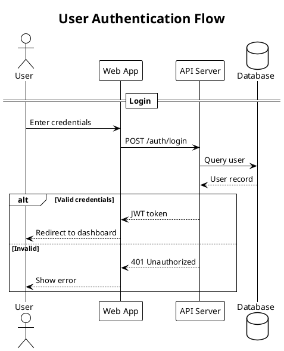
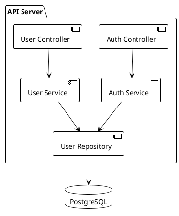

# Architecture Diagrams Skill

Create maintainable, well-organized architecture diagrams using diagrams-as-code approach.

## Supported Tools

- **Structurizr DSL** — C4 model diagrams (System Context, Container, Component, Deployment)
- **PlantUML** — All UML diagram types:
  - Sequence — Runtime interaction flows
  - Component — Architecture and module structure
  - Activity — Workflows and processes
  - Class — Domain models and OOP design
  - State — State machines and lifecycles
  - Use Case — Actor-system interactions
  - Deployment — Infrastructure and deployment
  - Object — Runtime object snapshots
- **Graphviz** — Dependency graphs, DOT notation

## Core Principles

### 1. Diagrams as Code
- All diagrams are text files in version control
- Diffs are readable and reviewable
- CI can validate and render automatically

### 2. One Purpose Per Diagram
- Each file has a single, clear purpose
- Split large diagrams into focused views
- Name files descriptively: `<domain>-<scenario>.<ext>`

### 3. Separation of Concerns
- **Model** defines elements (what exists)
- **Views** define presentation (what to show)
- **Styles** define appearance (how it looks)

### 4. Progressive Disclosure (C4)
- Level 1: System Context — big picture, external actors
- Level 2: Container — deployable units, tech choices
- Level 3: Component — internal structure
- Level 4: Code — class/interface level (rarely needed)

---

## C4 Model Ideology

The C4 model answers different questions at each level:

| Level | Diagram | Audience | Question Answered |
|-------|---------|----------|-------------------|
| 1 | System Context | Everyone | What is the system? Who uses it? What does it integrate with? |
| 2 | Container | Technical | What are the major building blocks? What technologies? |
| 3 | Component | Developers | How is a container structured internally? |
| 4 | Code | Developers | What are the classes/interfaces? (Usually auto-generated) |

**Key insight**: You don't need all 4 levels. Most teams use only Context + Container.

### C4 Abstractions

- **Person** — User, actor, role, persona (human or external system acting as user)
- **Software System** — Highest abstraction; the thing being built or interacting with
- **Container** — Deployable unit: app, service, database, file system, queue
- **Component** — Logical grouping inside a container (module, package, class cluster)

---

## Folder Structure

```
diagrams/
├── README.md                    # Tool setup & usage docs
├── c4/                          # Structurizr DSL
│   ├── workspace.dsl            # Minimal entrypoint
│   ├── model/
│   │   ├── 01-people.dsl        # Actors, users
│   │   ├── 02-systems.dsl       # Systems, containers, components
│   │   └── 99-relationships.dsl # All relationships (loaded last)
│   ├── views/
│   │   ├── context.dsl          # System context view
│   │   ├── containers.dsl       # Container view
│   │   └── components.dsl       # Component views
│   └── styles/
│       └── styles.dsl           # Visual theme
├── plantuml/
│   ├── _includes/               # Shared styling (optional)
│   │   ├── theme.puml
│   │   └── common.puml
│   ├── sequence/
│   │   └── auth-flow.puml
│   └── component/
│       └── api-structure.puml
└── artefacts/                   # Generated outputs (PNG/SVG)
    ├── c4/
    └── plantuml/
```

---

## Structurizr DSL Patterns

### Workspace Entrypoint (workspace.dsl)

Keep minimal — delegate via `!include`:

```dsl
workspace "Project Name" "Brief description" {
  !identifiers hierarchical

  model {
    !include model
  }

  views {
    !include views
    !include styles
  }
}
```

### Model Definition (model/02-systems.dsl)

Use hierarchical nesting:

```dsl
mySystem = softwareSystem "My System" "Description" {
  webapp = container "Web Application" "Serves UI" "React" {
    authModule = component "Auth Module" "Handles authentication" "TypeScript"
    apiClient = component "API Client" "Backend communication" "TypeScript"
  }

  api = container "API Server" "REST API" "Node.js" {
    authService = component "Auth Service" "JWT validation" "TypeScript"
    userService = component "User Service" "User CRUD" "TypeScript"
  }

  database = container "Database" "Stores data" "PostgreSQL" {
    tags "Database"
  }
}
```

### Relationships (model/99-relationships.dsl)

Centralize all relationships:

```dsl
# External relationships
user -> mySystem.webapp "Uses" "HTTPS"

# Internal relationships
mySystem.webapp -> mySystem.api "Calls" "REST/JSON"
mySystem.api -> mySystem.database "Reads/Writes" "SQL"

# Component-level
mySystem.webapp.authModule -> mySystem.api.authService "Authenticates" "JWT"
mySystem.webapp.apiClient -> mySystem.api.userService "CRUD operations" "REST"
```

### Views (views/context.dsl)

Keep views focused:

```dsl
systemContext mySystem "SystemContext" "System Context diagram" {
  include *
  autolayout lr
}
```

### Styles (styles/styles.dsl)

```dsl
styles {
  element "Person" {
    shape person
    background #08427b
    color #ffffff
  }
  element "Software System" {
    background #1168bd
    color #ffffff
  }
  element "Container" {
    background #438dd5
    color #ffffff
  }
  element "Component" {
    background #85bbf0
    color #000000
  }
  element "Database" {
    shape cylinder
  }
}
```

---

## PlantUML Patterns

### Sequence Diagram



### Component Diagram



### Key PlantUML Syntax

**Participants**: `actor`, `participant`, `boundary`, `control`, `entity`, `database`, `queue`

**Arrows**:
- `->` solid
- `-->` dotted
- `->>` thin
- `<->` bidirectional

**Control flow**:
- `alt/else/end` — conditional
- `opt/end` — optional
- `loop/end` — repetition
- `par/end` — parallel
- `break/end` — exit early

**Sections**: `== Section Name ==`

**Notes**: `note left of X: text`, `note over X,Y: text`

---

## Commands

### Structurizr CLI

```bash
# Validate DSL
structurizr validate -workspace diagrams/c4/workspace.dsl

# Export to PNG
structurizr export -workspace diagrams/c4/workspace.dsl -format png -output diagrams/artefacts/c4

# Export to SVG
structurizr export -workspace diagrams/c4/workspace.dsl -format svg -output diagrams/artefacts/c4

# Export to PlantUML (for further processing)
structurizr export -workspace diagrams/c4/workspace.dsl -format plantuml -output diagrams/artefacts/c4
```

### PlantUML

```bash
# Render single diagram
java -jar plantuml.jar diagram.puml

# Render all in directory
java -jar plantuml.jar -o ../artefacts/plantuml diagrams/plantuml/**/*.puml

# Generate SVG
java -jar plantuml.jar -tsvg diagram.puml
```

### Tool Installation

```bash
# Structurizr CLI (macOS)
brew install structurizr-cli

# PlantUML JAR
curl -L -o .temp/plantuml.jar https://github.com/plantuml/plantuml/releases/latest/download/plantuml.jar

# Graphviz (required for some PlantUML diagrams)
brew install graphviz
```

---

## Best Practices

### DO

- Use `!include` to split large DSL files
- Number model files for load order (01-, 02-, 99-)
- Use `autolayout` unless manual positioning is needed
- Keep views focused on one story
- Use hierarchical identifiers (`system.container.component`)
- Name files descriptively
- Commit generated artifacts for easy review

### DON'T

- Create monolithic workspace.dsl with everything
- Mix model and views in same file
- Include everything in one view
- Use Code diagrams unless auto-generated
- Create deep nesting in PlantUML (flatten with aliases)

---

## References

### Structurizr DSL
- @references/structurizr-dsl.md — DSL syntax reference

### PlantUML (All UML Types)
- @references/plantuml-sequence.md — Sequence diagrams (interactions, flows)
- @references/plantuml-component.md — Component diagrams (architecture)
- @references/plantuml-activity.md — Activity diagrams (workflows, processes)
- @references/plantuml-class.md — Class diagrams (domain model, OOP)
- @references/plantuml-state.md — State diagrams (state machines, lifecycle)
- @references/plantuml-usecase.md — Use Case diagrams (actors, requirements)
- @references/plantuml-deployment.md — Deployment diagrams (infrastructure)
- @references/plantuml-object.md — Object diagrams (runtime snapshots)

### Templates
- @templates/ — Starter templates

---

## When to Use Each Tool

| Need | Tool |
|------|------|
| System architecture overview | Structurizr (C4 Context) |
| Technology landscape | Structurizr (C4 Container) |
| Internal module structure | Structurizr (C4 Component) |
| Runtime interaction flow | PlantUML Sequence |
| API/module structure | PlantUML Component |
| Process/workflow/algorithm | PlantUML Activity |
| Domain model/OOP design | PlantUML Class |
| State machine/lifecycle | PlantUML State |
| Requirements/actors | PlantUML Use Case |
| Infrastructure/deployment | PlantUML Deployment |
| Runtime object snapshot | PlantUML Object |
| Quick dependency graph | Graphviz DOT |
