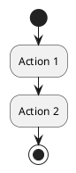

# PlantUML Activity Diagram Reference

## Basic Syntax



## Actions

### Simple Action

```plantuml
:Action;
```

### Multi-line Action

```plantuml
:This is a
multi-line
action;
```

### Action Shapes

```plantuml
:Standard;           ' Rectangle
|Swimlane|
:In swimlane;
```

## Start/Stop/End

```plantuml
start                ' Filled circle
stop                 ' Filled circle with border
end                  ' X symbol (error/kill)
detach               ' Detach flow (no symbol)
```

## Conditionals

### If/Then/Else

```plantuml
if (condition?) then (yes)
  :Action A;
else (no)
  :Action B;
endif
```

### If/Elseif/Else

```plantuml
if (condition 1?) then (yes)
  :Action A;
elseif (condition 2?) then (yes)
  :Action B;
elseif (condition 3?) then (yes)
  :Action C;
else (none)
  :Default action;
endif
```

### Horizontal Style

```plantuml
if (condition?) then (yes)
  :Action;
else (no)
  :Other;
endif
' Use -left-> or -right-> for arrow direction
```

### Switch/Case

```plantuml
switch (value?)
case (1)
  :Action 1;
case (2)
  :Action 2;
case (3)
  :Action 3;
endswitch
```

## Loops

### While Loop

```plantuml
while (condition?) is (yes)
  :Action;
endwhile (no)
```

### Backward (do-while)

```plantuml
repeat
  :Action;
repeat while (condition?) is (yes)
->no;
```

### With Notes

```plantuml
while (items remaining?) is (yes)
  :Process item;
  backward :Log progress;
endwhile (no)
```

## Parallel/Fork

### Fork/Join

```plantuml
fork
  :Task A;
fork again
  :Task B;
fork again
  :Task C;
end fork
```

### Merge (End Fork with Condition)

```plantuml
fork
  :Async Task 1;
fork again
  :Async Task 2;
end merge
' Continues when first branch completes
```

### Fork with Join Labels

```plantuml
fork
  :Branch A;
fork again
  :Branch B;
end fork {and}
' Options: {and}, {or}, {xor}
```

## Swimlanes

### Basic Swimlanes

```plantuml
|Swimlane 1|
:Action in lane 1;

|Swimlane 2|
:Action in lane 2;

|Swimlane 1|
:Back to lane 1;
```

### Colored Swimlanes

```plantuml
|#lightblue|Frontend|
:User clicks button;

|#lightgreen|Backend|
:Process request;

|#lightyellow|Database|
:Query data;
```

### Swimlane with Alias

```plantuml
|#pink|U| User
|#lightblue|S| System
|#lightgreen|D| Database

|U|
:Submit form;

|S|
:Validate input;

|D|
:Save record;
```

## Grouping

### Partition

```plantuml
partition "Initialization" {
  :Load config;
  :Setup connections;
}

partition "Processing" {
  :Process data;
  :Generate output;
}
```

### Colored Partition

```plantuml
partition #lightblue "Authentication" {
  :Check credentials;
  :Generate token;
}
```

### Group (Alternative)

```plantuml
group Validation
  :Check format;
  :Verify data;
end group
```

## Connectors

### Named Connectors

```plantuml
:Action 1;
(A)
' ... other actions ...
(A)
:Action 2;
```

### Detach (Kill Path)

```plantuml
if (error?) then (yes)
  :Log error;
  detach
endif
:Continue normal flow;
```

## Notes

### Note on Activity

```plantuml
:Action;
note right
  This is a note
  on the right
end note
```

### Note Positions

```plantuml
:Action;
note left: Left note
note right: Right note

' Floating notes
note "Important" as N1
```

### Note on Partition

```plantuml
partition "Process" {
  :Step 1;
  :Step 2;
}
note right of partition: Partition note
```

## Arrows and Labels

### Arrow Labels

```plantuml
:Action 1;
-> Label;
:Action 2;
```

### Arrow Direction

```plantuml
:Start;
-right-> goes right;
:Right;
-down-> goes down;
:Down;
-left-> goes left;
:Left;
```

### Arrow Colors

```plantuml
:Success;
-[#green]-> OK;
:Continue;

:Error;
-[#red]-> Failed;
:Handle error;
```

### Dotted Arrows

```plantuml
:Action;
-[dotted]->
:Next;
```

## Colors and Styling

### Action Colors

```plantuml
#lightblue:Styled action;
#pink:Another styled;
```

### Conditional Colors

```plantuml
if (condition?) then (yes)
  #lightgreen:Success action;
else (no)
  #pink:Failure action;
endif
```

### Skinparam

```plantuml
skinparam activity {
  BackgroundColor #EFEFEF
  BorderColor #333333
  FontSize 14
}

skinparam activityDiamond {
  BackgroundColor #FEFECE
  BorderColor #A80036
}

skinparam arrow {
  Color #333333
}
```

## Complete Example

```plantuml
@startuml
!theme plain

title Order Processing Workflow

|#lightblue|Customer|
start
:Place order;

|#lightgreen|Order Service|
:Receive order;
:Validate order;

if (valid?) then (yes)
  :Calculate total;

  |#lightyellow|Inventory|
  :Check stock;

  if (in stock?) then (yes)
    :Reserve items;

    |#lightgreen|Order Service|
    |#pink|Payment|
    :Process payment;

    if (payment ok?) then (yes)
      |#lightyellow|Inventory|
      :Update inventory;

      |#lightgreen|Order Service|
      :Create shipment;

      |#lightblue|Customer|
      :Receive confirmation;
      stop
    else (no)
      |#lightgreen|Order Service|
      :Cancel order;

      |#lightblue|Customer|
      :Payment failed notification;
      stop
    endif
  else (no)
    |#lightgreen|Order Service|
    :Notify out of stock;

    |#lightblue|Customer|
    :Receive backorder option;
    stop
  endif
else (no)
  |#lightblue|Customer|
  :Validation error;
  stop
endif

@enduml
```

## Error Handling Pattern

```plantuml
@startuml
!theme plain

start
:Begin transaction;

partition "Try Block" {
  :Operation 1;
  :Operation 2;
  if (error?) then (yes)
    -[#red]-> error;
    :Rollback;
    :Log error;
    end
  endif
  :Operation 3;
}

:Commit transaction;
stop

@enduml
```

## Async Process Pattern

```plantuml
@startuml
!theme plain

|User|
start
:Submit request;

|API|
:Receive request;
:Create job;
:Return job ID;

fork
  |Worker|
  :Process job;
  :Update status;
fork again
  |API|
  :Return immediately;

  |User|
  :Receive job ID;

  while (job complete?) is (no)
    :Poll status;
    :Wait;
  endwhile (yes)

  :Get results;
end fork

stop
@enduml
```
