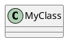

# PlantUML Class Diagram Reference

## Basic Class



## Class with Members

```plantuml
class User {
  +id: Int
  +name: String
  -password: String
  #createdAt: Date
  ~internalFlag: Bool

  +login(): Bool
  +logout(): void
  -hashPassword(p: String): String
}
```

## Visibility Modifiers

```plantuml
- private
+ public
# protected
~ package private
```

## Abstract and Static

```plantuml
class Example {
  {static} +instanceCount: Int
  {abstract} +process(): void
  {static} +create(): Example
}
```

## Field and Method Modifiers

```plantuml
class MyClass {
  {field} This is a field description
  {method} This is a method description
}
```

## Interfaces

```plantuml
interface Drawable {
  +draw(): void
  +resize(w: Int, h: Int): void
}

interface Serializable <<interface>> {
  +serialize(): Data
}
```

## Abstract Classes

```plantuml
abstract class Shape {
  +x: Int
  +y: Int
  {abstract} +area(): Double
  +move(dx: Int, dy: Int): void
}
```

## Enums

```plantuml
enum Status {
  PENDING
  ACTIVE
  COMPLETED
  CANCELLED
}

enum Color {
  RED
  GREEN
  BLUE
  --
  +hex(): String
}
```

## Generics

```plantuml
class List<T> {
  +add(item: T): void
  +get(index: Int): T
}

class Map<K, V> {
  +put(key: K, value: V): void
  +get(key: K): V
}
```

## Relationships

### Association

```plantuml
ClassA -- ClassB
ClassA "1" -- "many" ClassB : has
```

### Directed Association

```plantuml
ClassA --> ClassB
ClassA --> ClassB : uses
```

### Inheritance (Extends)

```plantuml
Parent <|-- Child
' or
Child --|> Parent
```

### Implementation (Implements)

```plantuml
Interface <|.. Implementation
' or
Implementation ..|> Interface
```

### Aggregation (Has-A, weak)

```plantuml
Container o-- Part
' Diamond at container end
```

### Composition (Has-A, strong)

```plantuml
Container *-- Part
' Filled diamond at container end
```

### Dependency

```plantuml
ClassA ..> ClassB : uses
```

## Cardinality/Multiplicity

```plantuml
Class1 "1" -- "1" Class2
Class1 "1" -- "*" Class2
Class1 "1" -- "0..*" Class2
Class1 "1..*" -- "0..1" Class2
Class1 "n" -- "m" Class2
```

## Arrow Directions

```plantuml
A -left-> B
A -right-> B
A -up-> B
A -down-> B

' Short form
A -l-> B
A -r-> B
A -u-> B
A -d-> B
```

## Arrow Styles

```plantuml
A --> B         ' Solid arrow
A ..> B         ' Dotted arrow
A --  B         ' Solid line
A ..  B         ' Dotted line
A --o B         ' Aggregation
A --* B         ' Composition
A <|-- B        ' Inheritance
A <|.. B        ' Implementation
A #-- B         ' Solid bold
A x-- B         ' Cross
```

## Packages and Namespaces

### Package

```plantuml
package "Domain" {
  class User
  class Order
}

package "Services" {
  class UserService
  class OrderService
}
```

### Namespace

```plantuml
namespace com.example.domain {
  class User
  class Order
}

namespace com.example.services {
  class UserService
}

com.example.services.UserService --> com.example.domain.User
```

### Package Styles

```plantuml
package "Node Style" <<Node>> {
  class A
}

package "Rectangle Style" <<Rectangle>> {
  class B
}

package "Folder Style" <<Folder>> {
  class C
}

package "Frame Style" <<Frame>> {
  class D
}

package "Cloud Style" <<Cloud>> {
  class E
}

package "Database Style" <<Database>> {
  class F
}
```

## Stereotypes

```plantuml
class User <<Entity>>
class UserService <<Service>>
class UserController <<Controller>>
class UserRepository <<Repository>>

interface Auditable <<interface>>

class "Thread" as T <<(T,#FF7700) Thread>>
```

### Custom Spots

```plantuml
class System << (S,#FF7700) Singleton >>
class Factory << (F,#00FF00) Factory >>
```

## Notes

```plantuml
class User {
  +name: String
}

note left of User : This is a note

note right of User
  Multi-line
  note here
end note

note "Floating note" as N1
User .. N1

note top of User : Top note
note bottom of User : Bottom note
```

### Notes on Members

```plantuml
class User {
  +id: Int
  +name: String
}
note left of User::id
  Primary key
end note
```

## Class Body Separators

```plantuml
class MyClass {
  .. Fields ..
  +field1: String
  +field2: Int
  __ Private __
  -secret: String
  == Methods ==
  +method1(): void
  -- Internal --
  -helper(): void
}
```

## Colors

```plantuml
class Red #red
class Green #lightgreen
class Blue #AAAAFF

class Styled #back:lightblue;line:blue;text:navy
```

### Gradient

```plantuml
class MyClass #red/yellow
```

## Skinparam

```plantuml
skinparam class {
  BackgroundColor #EFEFEF
  BorderColor #333333
  ArrowColor #333333
  FontSize 12
}

skinparam classAttribute {
  FontSize 10
}

skinparam stereotype {
  CBackgroundColor #ADD1B2
}
```

### Hide/Show

```plantuml
hide empty members
hide methods
hide fields
show User methods
show User fields
```

## Complete Example

```plantuml
@startuml
!theme plain

title Domain Model

package "Domain" {
  abstract class Entity {
    +id: UUID
    +createdAt: Date
    +updatedAt: Date
  }

  class User {
    +email: String
    +name: String
    -passwordHash: String
    +authenticate(password: String): Bool
  }

  class Order {
    +status: OrderStatus
    +total: Decimal
    +place(): void
    +cancel(): void
  }

  class OrderItem {
    +quantity: Int
    +price: Decimal
  }

  class Product {
    +name: String
    +sku: String
    +price: Decimal
  }

  enum OrderStatus {
    PENDING
    CONFIRMED
    SHIPPED
    DELIVERED
    CANCELLED
  }
}

package "Repositories" <<Database>> {
  interface Repository<T> {
    +findById(id: UUID): T
    +save(entity: T): void
    +delete(entity: T): void
  }

  class UserRepository implements Repository
  class OrderRepository implements Repository
  class ProductRepository implements Repository
}

' Inheritance
Entity <|-- User
Entity <|-- Order
Entity <|-- Product
Entity <|-- OrderItem

' Associations
User "1" -- "0..*" Order : places
Order "1" *-- "1..*" OrderItem : contains
OrderItem "0..*" --> "1" Product : references
Order --> OrderStatus

' Repository dependencies
UserRepository ..> User
OrderRepository ..> Order
ProductRepository ..> Product

@enduml
```

## Design Pattern: Repository

```plantuml
@startuml
!theme plain

interface Repository<T, ID> {
  +findById(id: ID): Optional<T>
  +findAll(): List<T>
  +save(entity: T): T
  +delete(entity: T): void
}

interface UserRepository extends Repository {
  +findByEmail(email: String): Optional<User>
  +findByStatus(status: Status): List<User>
}

class UserRepositoryImpl implements UserRepository {
  -dataSource: DataSource
  +findById(id: ID): Optional<User>
  +findByEmail(email: String): Optional<User>
}

class User <<Entity>> {
  +id: UUID
  +email: String
  +name: String
}

UserRepositoryImpl ..> User : manages

@enduml
```

## Design Pattern: Factory

```plantuml
@startuml
!theme plain

interface Product {
  +operation(): String
}

class ConcreteProductA implements Product {
  +operation(): String
}

class ConcreteProductB implements Product {
  +operation(): String
}

abstract class Creator {
  {abstract} +factoryMethod(): Product
  +someOperation(): String
}

class ConcreteCreatorA extends Creator {
  +factoryMethod(): Product
}

class ConcreteCreatorB extends Creator {
  +factoryMethod(): Product
}

ConcreteCreatorA ..> ConcreteProductA : creates
ConcreteCreatorB ..> ConcreteProductB : creates

@enduml
```
