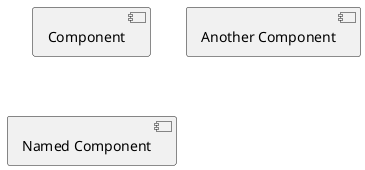
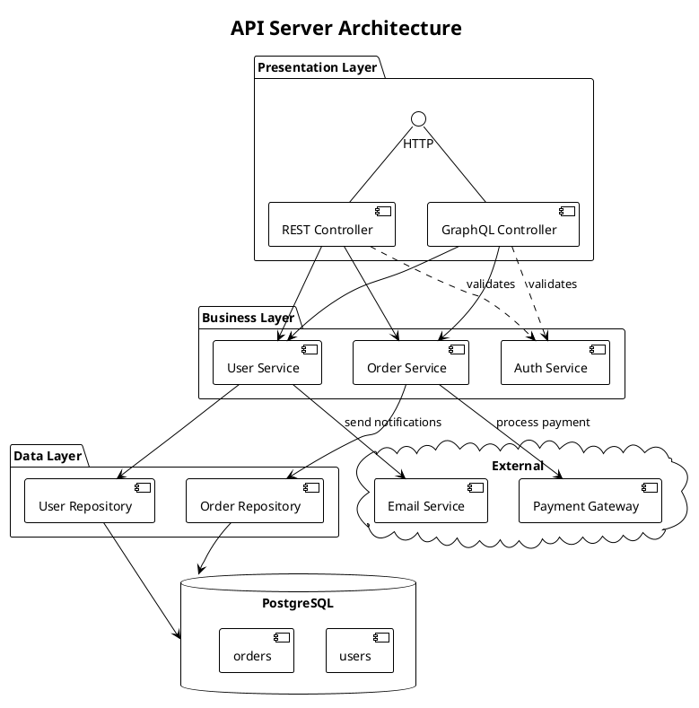
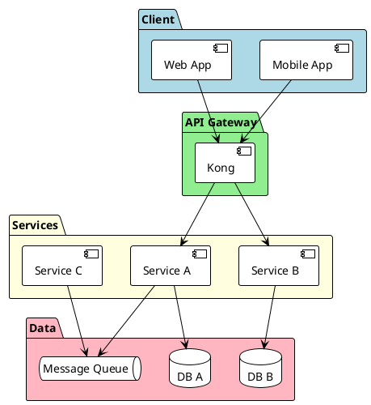
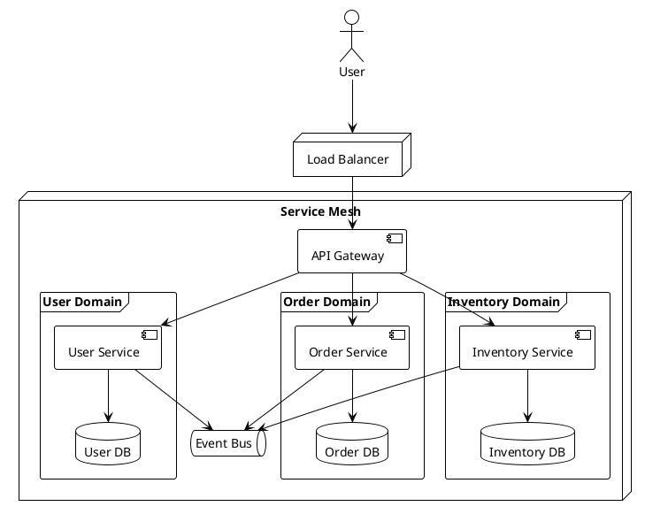

# PlantUML Component Diagram Reference

## Basic Components



## Interfaces

```plantuml
() "Interface"
() "Named Interface" as NI
interface "Full Interface" as FI
```

## Connections

### Basic

```plantuml
[Component] --> Interface
[Component] ..> Interface : uses
Interface -- [Component]
```

### Arrow Types

```plantuml
A --> B       # Solid arrow
A ..> B       # Dotted arrow
A --  B       # Solid line
A ..  B       # Dotted line
A --o B       # Aggregation
A --* B       # Composition
A <|-- B      # Inheritance
```

### Direction Control

```plantuml
[A] -left-> [B]
[A] -right-> [B]
[A] -up-> [B]
[A] -down-> [B]

# Short forms
[A] -l-> [B]
[A] -r-> [B]
[A] -u-> [B]
[A] -d-> [B]
```

## Containers

### Package

```plantuml
package "API Layer" {
  [REST Controller]
  [GraphQL Controller]
}
```

### Node

```plantuml
node "Server" {
  [Application]
  [Cache]
}
```

### Folder

```plantuml
folder "Services" {
  [User Service]
  [Order Service]
}
```

### Frame

```plantuml
frame "Module" {
  [Component A]
  [Component B]
}
```

### Cloud

```plantuml
cloud "AWS" {
  [Lambda]
  [S3]
}
```

### Database

```plantuml
database "PostgreSQL" {
  [Users Table]
  [Orders Table]
}
```

## Ports

```plantuml
component Component {
  port p1
  portin p2
  portout p3
}

[Client] --> p1
p2 --> [Internal]
p3 --> [External]
```

## Notes

```plantuml
[Component]
note left of Component: Left note
note right of Component: Right note
note top of Component: Top note
note bottom of Component: Bottom note

note "Floating note" as N1
Component .. N1
```

## Colors

```plantuml
[Component] #lightblue
[Warning Component] #red

package "Styled" #lightgreen {
  [Inner] #yellow
}
```

## Stereotypes

```plantuml
[Service] <<Service>>
[Controller] <<REST>>

component "Auth" <<Security>> {
  [JWT Handler]
}
```

## Skinparam

```plantuml
skinparam component {
  BackgroundColor #EFEFEF
  BorderColor #333333
  ArrowColor #333333
}

skinparam componentStyle rectangle
' Options: uml1, uml2, rectangle
```

## Complete Example



## Layer Pattern



## Microservices Pattern


