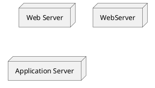
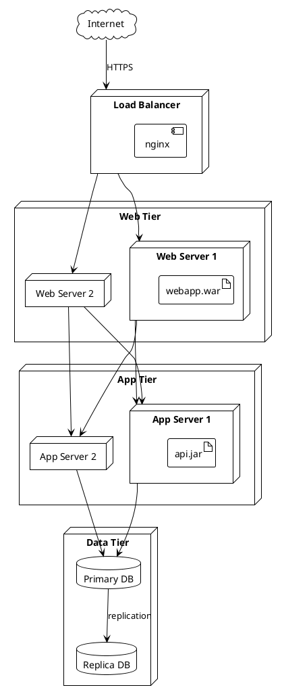

# PlantUML Deployment Diagram Reference

## Basic Elements

### Node



### Artifact

```plantuml
artifact "app.jar"
artifact "config.xml"
artifact MyArtifact
```

### Component

```plantuml
component "API Service"
[Component Shorthand]
```

### Database

```plantuml
database "PostgreSQL"
database MySQL
```

## Node Types

```plantuml
node "Generic Node"
cloud "Cloud Service"
database "Database"
storage "File Storage"
queue "Message Queue"
folder "Directory"
frame "Frame"
package "Package"
rectangle "Rectangle"
card "Card"
file "File"
collections "Collection"
hexagon "Hexagon"
stack "Stack"
```

## Connections

### Basic

```plantuml
node A
node B
A --> B
A -- B      ' No arrow
A <--> B    ' Bidirectional
```

### With Labels

```plantuml
WebServer --> AppServer : HTTP/REST
AppServer --> Database : JDBC
AppServer --> Cache : TCP
```

### Arrow Types

```plantuml
A --> B     ' Solid arrow
A ..> B     ' Dotted arrow
A --  B     ' Solid line
A ..  B     ' Dotted line
A ==> B     ' Bold arrow
A ~~> B     ' Wavy arrow (rare)
```

### Direction Control

```plantuml
A -left-> B
A -right-> B
A -up-> B
A -down-> B

' Short forms
A -l-> B
A -r-> B
A -u-> B
A -d-> B
```

## Nesting (Deployment)

```plantuml
node "Production Server" {
  component "Web Application"
  component "API Service"
  database "Local Cache"
}
```

### Deep Nesting

```plantuml
cloud "AWS" {
  node "EC2 Instance" {
    artifact "Docker Container" {
      component "Application"
    }
  }

  database "RDS" {
    artifact "PostgreSQL"
  }
}
```

## Artifacts Inside Nodes

```plantuml
node "Application Server" {
  artifact "app.war" {
    [Service Layer]
    [Data Layer]
  }

  artifact "config.properties"
  artifact "log4j.xml"
}
```

## Complex Deployment



## Port and Interface

```plantuml
node Server {
  portin p1
  portout p2

  component App
  p1 --> App
  App --> p2
}

node Client
Client --> Server::p1
Server::p2 --> ExternalService
```

## Stereotypes

```plantuml
node "Web Server" <<physical>>
node "Container" <<docker>>
database "Cache" <<redis>>
cloud "AWS" <<amazon>>
```

## Colors and Styling

### Node Colors

```plantuml
node "Production" #lightgreen
node "Staging" #lightyellow
node "Development" #lightblue
database "DB" #pink
```

### Line Colors

```plantuml
A -[#blue]-> B : secure
A -[#red,dashed]-> C : deprecated
```

### Gradient

```plantuml
node "Server" #lightblue/lightgreen
```

## Notes

```plantuml
node Server

note left of Server
  Production server
  Ubuntu 22.04
end note

note right of Server : High availability

note "Floating note" as N1
Server .. N1
```

## Skinparam

```plantuml
skinparam node {
  BackgroundColor #EFEFEF
  BorderColor #333333
}

skinparam database {
  BackgroundColor #FEFECE
  BorderColor #A80036
}

skinparam artifact {
  BackgroundColor #D4E6F1
  BorderColor #2874A6
}

skinparam component {
  BackgroundColor #E8DAEF
  BorderColor #7D3C98
}
```

### Node Styles

```plantuml
skinparam nodeStyle rectangle
' Options: rectangle, folder
```

## Layout

```plantuml
left to right direction
' or
top to bottom direction  ' default
```

## Complete Example: Microservices Deployment

```plantuml
@startuml
!theme plain

title Microservices Deployment Architecture

left to right direction

cloud "CDN" as cdn {
  storage "Static Assets"
}

cloud "API Gateway" as gw {
  component "Kong"
}

frame "Kubernetes Cluster" {
  node "Namespace: frontend" {
    artifact "web-app:v1.2" {
      [React SPA]
    }
  }

  node "Namespace: services" {
    artifact "user-service:v2.0" {
      [User API]
    }
    artifact "order-service:v1.5" {
      [Order API]
    }
    artifact "payment-service:v1.1" {
      [Payment API]
    }
  }

  node "Namespace: data" {
    database "PostgreSQL" as pg {
      artifact "users_db"
      artifact "orders_db"
    }
    database "Redis" as redis {
      artifact "cache"
      artifact "sessions"
    }
    queue "RabbitMQ" as mq {
      artifact "events"
    }
  }
}

cloud "External Services" {
  component "Stripe API" as stripe
  component "SendGrid" as email
}

' Connections
cdn --> gw : HTTPS
gw --> [React SPA]
gw --> [User API]
gw --> [Order API]
gw --> [Payment API]

[User API] --> pg
[Order API] --> pg
[Payment API] --> pg

[User API] --> redis
[Order API] --> redis

[Order API] --> mq : publish
[Payment API] --> mq : subscribe

[Payment API] --> stripe
[User API] --> email

note right of gw
  Rate limiting
  Authentication
  Load balancing
end note

@enduml
```

## Complete Example: AWS Architecture

```plantuml
@startuml
!theme plain

title AWS Deployment

cloud "AWS Cloud" {
  frame "VPC" {
    frame "Public Subnet" {
      node "ALB" as alb {
        component "Load Balancer"
      }

      node "NAT Gateway" as nat
    }

    frame "Private Subnet - App" {
      node "ECS Cluster" {
        artifact "Task: Web" {
          [Web Container]
        }
        artifact "Task: API" {
          [API Container]
        }
        artifact "Task: Worker" {
          [Worker Container]
        }
      }
    }

    frame "Private Subnet - Data" {
      database "RDS Aurora" as rds {
        artifact "Primary"
        artifact "Replica"
      }

      database "ElastiCache" as cache {
        artifact "Redis Cluster"
      }
    }
  }

  storage "S3" {
    artifact "media-bucket"
    artifact "logs-bucket"
  }

  queue "SQS" {
    artifact "job-queue"
  }

  cloud "CloudFront" as cf
}

actor User

User --> cf
cf --> alb
alb --> [Web Container]
[Web Container] --> [API Container]
[API Container] --> rds
[API Container] --> cache
[API Container] --> SQS
[Worker Container] --> SQS
[Worker Container] --> rds
[API Container] --> S3
[Worker Container] --> S3

nat --> Internet : outbound

@enduml
```

## Docker Compose Style

```plantuml
@startuml
!theme plain

title Docker Compose Deployment

node "Docker Host" {
  artifact "docker-compose.yml" as compose

  frame "Network: app-network" {
    artifact "nginx:latest" {
      [nginx]
      portin 80
      portin 443
    }

    artifact "app:v1.0" {
      [app]
      portin 3000
    }

    artifact "postgres:14" {
      [postgres]
      portin 5432
    }

    artifact "redis:7" {
      [redis]
      portin 6379
    }
  }

  storage "Volumes" {
    folder "postgres-data"
    folder "redis-data"
    folder "app-logs"
  }
}

[nginx] --> [app] : proxy_pass
[app] --> [postgres] : DATABASE_URL
[app] --> [redis] : REDIS_URL

[postgres] --> "postgres-data" : mount
[redis] --> "redis-data" : mount
[app] --> "app-logs" : mount

@enduml
```

## On-Premise to Cloud Migration

```plantuml
@startuml
!theme plain

title Hybrid Deployment

frame "On-Premise Data Center" #lightgray {
  node "Legacy Server" {
    artifact "legacy-app.war" {
      [Legacy System]
    }
    database "Oracle DB" as oracle
  }

  node "File Server" {
    storage "NFS Share"
  }
}

cloud "AWS" #lightblue {
  node "EC2" {
    artifact "integration-service" {
      [Integration API]
    }
  }

  database "RDS" as rds

  queue "SQS" {
    artifact "sync-queue"
  }

  storage "S3" {
    artifact "archive"
  }
}

frame "VPN Tunnel" as vpn #lightyellow

[Legacy System] <--> vpn
vpn <--> [Integration API]
[Integration API] --> rds
[Legacy System] --> oracle
[Integration API] --> SQS
[Integration API] --> S3
"NFS Share" --> S3 : backup

note bottom of vpn
  Site-to-Site VPN
  256-bit encryption
end note

@enduml
```
