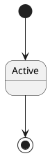

# PlantUML State Diagram Reference

## Basic States



## State Declaration

```plantuml
state "Long State Name" as LSN
state Active
state Inactive
state "Pending Approval" as Pending
```

## Transitions

### Simple Transition

```plantuml
StateA --> StateB
StateA -> StateB    ' Short arrow
StateA -right-> StateB
```

### Transition with Label

```plantuml
Idle --> Running : start()
Running --> Stopped : stop()
Running --> Running : process()
```

### Transition with Guard

```plantuml
Pending --> Approved : [valid]
Pending --> Rejected : [invalid]
```

### Transition with Action

```plantuml
Idle --> Running : start() / initialize()
Running --> Stopped : stop() / cleanup()
```

## Start and End States

```plantuml
[*] --> FirstState        ' Initial state
LastState --> [*]         ' Final state

state Fork <<fork>>
state Join <<join>>
```

## Composite States

### Simple Composite

```plantuml
state Active {
  [*] --> Running
  Running --> Paused : pause()
  Paused --> Running : resume()
  Running --> [*] : complete()
}
```

### Nested Composite

```plantuml
state Processing {
  state Validation {
    [*] --> CheckFormat
    CheckFormat --> CheckRules
    CheckRules --> [*]
  }

  state Execution {
    [*] --> Prepare
    Prepare --> Execute
    Execute --> Cleanup
    Cleanup --> [*]
  }

  [*] --> Validation
  Validation --> Execution
  Execution --> [*]
}
```

## Concurrent States

```plantuml
state Active {
  [*] --> Working
  Working --> Idle
  --
  [*] --> Monitoring
  Monitoring --> Alerting
}
```

### Named Concurrent Regions

```plantuml
state Running {
  state "Worker Thread" as WT {
    [*] --> Processing
    Processing --> Waiting
  }
  --
  state "Monitor Thread" as MT {
    [*] --> Checking
    Checking --> Reporting
  }
}
```

## History States

### Shallow History

```plantuml
state Active {
  state Processing
  state Waiting
  [H] --> Processing
}

Paused --> Active[H] : resume
' Returns to last active substate
```

### Deep History

```plantuml
state Active {
  state Level1 {
    state Level2 {
      state Deep
    }
  }
  [H*] --> Level1
}

Suspended --> Active[H*] : resume
' Returns to deepest active substate
```

## Choice/Decision

```plantuml
state choice <<choice>>

Pending --> choice
choice --> Approved : [score >= 70]
choice --> Rejected : [score < 70]
```

### Multiple Choices

```plantuml
state decision <<choice>>

New --> decision : evaluate
decision --> Low : [priority == 1]
decision --> Medium : [priority == 2]
decision --> High : [priority == 3]
decision --> Critical : [priority > 3]
```

## Fork and Join (Parallel)

```plantuml
state fork_state <<fork>>
state join_state <<join>>

[*] --> fork_state
fork_state --> TaskA
fork_state --> TaskB
fork_state --> TaskC

TaskA --> join_state
TaskB --> join_state
TaskC --> join_state

join_state --> Done
Done --> [*]
```

## Entry/Exit Points

```plantuml
state Active {
  state entryPoint <<entryPoint>>
  state exitPoint <<exitPoint>>

  entryPoint --> Working
  Working --> exitPoint
}

Idle --> Active::entryPoint : activate
Active::exitPoint --> Idle : deactivate
```

## Internal Transitions

```plantuml
state Active {
  Active : entry / setup()
  Active : exit / teardown()
  Active : do / process()
}
```

### Entry/Exit Actions

```plantuml
state Running {
  Running : entry / startTimer()
  Running : exit / stopTimer()
  Running : onError / logError()
}
```

## State Descriptions

```plantuml
state Pending : Waiting for approval
state Active : System is running
state "Error State" as Error : Something went wrong

' Multi-line
state Processing {
  Processing : Line 1
  Processing : Line 2
}
```

## Notes

```plantuml
state Active

note left of Active
  This state is
  the main state
end note

note right of Active : Short note

note "Floating note" as N1
Active .. N1
```

## Colors and Styling

### State Colors

```plantuml
state Active #lightgreen
state Error #red
state Warning #yellow
state Inactive #gray
```

### Line Colors

```plantuml
Active -[#blue]-> Inactive
Error -[#red,dashed]-> Recovery
```

### Stereotypes

```plantuml
state Active <<running>>
state Error <<fault>>
state Maintenance <<scheduled>>
```

## Skinparam

```plantuml
skinparam state {
  BackgroundColor #EFEFEF
  BorderColor #333333
  FontSize 12
  ArrowColor #333333
}

skinparam state<<running>> {
  BackgroundColor lightgreen
}

skinparam state<<fault>> {
  BackgroundColor pink
}
```

### Hide Empty Description

```plantuml
hide empty description
```

## Layout Direction

```plantuml
left to right direction
' or
top to bottom direction  ' default
```

## Complete Example: Order State Machine

```plantuml
@startuml
!theme plain

title Order State Machine

hide empty description

[*] --> Draft

state Draft {
  Draft : Customer is building order
}

state "Pending Payment" as Pending {
  Pending : Awaiting payment
}

state Paid {
  Paid : Payment received
}

state Processing {
  [*] --> Validating
  Validating --> Picking : [valid]
  Validating --> [*] : [invalid]
  Picking --> Packing
  Packing --> [*]

  Processing : Order being fulfilled
}

state Shipped {
  Shipped : In transit
}

state Delivered {
  Delivered : Customer received
}

state Cancelled {
  Cancelled : Order cancelled
}

state Refunded {
  Refunded : Money returned
}

Draft --> Pending : submit()
Pending --> Paid : paymentReceived()
Pending --> Cancelled : cancel()
Paid --> Processing : process()
Processing --> Shipped : ship()
Processing --> Cancelled : cancel() [before shipping]
Shipped --> Delivered : confirmDelivery()
Delivered --> Refunded : requestRefund()
Cancelled --> Refunded : [paid]
Delivered --> [*]
Refunded --> [*]

note right of Pending
  Timeout after 24h
  auto-cancels order
end note

note right of Processing
  Parallel inventory
  and payment checks
end note

@enduml
```

## Complete Example: Authentication State

```plantuml
@startuml
!theme plain

title User Authentication States

hide empty description

state choice <<choice>>
state fork_state <<fork>>
state join_state <<join>>

[*] --> Anonymous

state Anonymous {
  Anonymous : Not logged in
}

state "Authenticating" as Auth {
  [*] --> Credentials
  Credentials --> Validating : submit
  Validating --> [*] : done
}

Anonymous --> Auth : login()
Auth --> choice : validate

choice --> Authenticated : [valid]
choice --> Anonymous : [invalid]

state Authenticated {
  [*] --> Active

  state Active {
    Active : Session valid
    Active : entry / startSession()
    Active : exit / endSession()
  }

  state Idle {
    Idle : Waiting for activity
  }

  state "MFA Required" as MFA {
    MFA : Additional verification
  }

  Active --> Idle : timeout
  Idle --> Active : activity
  Active --> MFA : sensitiveAction()
  MFA --> Active : verified()
}

Authenticated --> Anonymous : logout()
Authenticated --> Anonymous : sessionExpired()

note right of MFA
  Required for:
  - Password change
  - Payment
  - Admin actions
end note

@enduml
```

## Job/Task Lifecycle Pattern

```plantuml
@startuml
!theme plain

title Background Job Lifecycle

[*] --> Pending

state Pending #lightyellow {
  Pending : Queued for execution
}

state Running #lightblue {
  [*] --> Initializing
  Initializing --> Executing
  Executing --> Finalizing
  Finalizing --> [*]
}

state Completed #lightgreen {
  Completed : Successfully finished
}

state Failed #pink {
  Failed : Execution error
}

state Retrying #lightyellow {
  Retrying : Waiting for retry
}

state Cancelled #gray {
  Cancelled : Manually cancelled
}

Pending --> Running : execute()
Pending --> Cancelled : cancel()

Running --> Completed : success
Running --> Failed : error
Running --> Cancelled : cancel()

Failed --> Retrying : [retries < max]
Failed --> [*] : [retries >= max]

Retrying --> Pending : retryDelay()

Completed --> [*]
Cancelled --> [*]

@enduml
```
