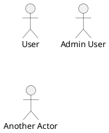
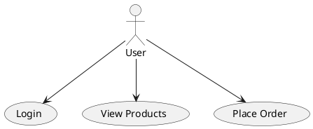

# PlantUML Use Case Diagram Reference

## Basic Elements

### Actor



### Use Case

```plantuml
(Login)
(Place Order)
usecase "Manage Users" as UC1
usecase (Another Use Case) as UC2
```

## Basic Diagram



## Actor Types

```plantuml
actor User
actor :Named Actor:
:Alternate Syntax:

' Business actor
actor/ "Business Actor"

' Stick figure variations
:User: as U1
actor "User" as U2 <<human>>
```

## Connections

### Basic Association

```plantuml
actor User
User --> (Use Case)
User -- (Use Case)    ' No arrow
(Use Case) <-- User   ' Reverse arrow
```

### Include (Mandatory)

```plantuml
(Place Order) ..> (Validate User) : <<include>>
' Place Order always includes Validate User
```

### Extend (Optional)

```plantuml
(Login) <.. (Login with 2FA) : <<extend>>
' Login with 2FA optionally extends Login
```

### Generalization

```plantuml
' Actor inheritance
:Admin: --|> :User:

' Use case generalization
(Pay) <|-- (Pay with Card)
(Pay) <|-- (Pay with Cash)
```

## System Boundary

### Rectangle

```plantuml
rectangle "E-Commerce System" {
  (Browse Products)
  (Add to Cart)
  (Checkout)
  (Process Payment)
}

actor Customer
Customer --> (Browse Products)
Customer --> (Add to Cart)
Customer --> (Checkout)
```

### Package

```plantuml
package "Authentication Module" {
  (Login)
  (Register)
  (Reset Password)
  (Two-Factor Auth)

  (Login) ..> (Two-Factor Auth) : <<extend>>
}
```

### Nested Boundaries

```plantuml
rectangle "Online Store" {
  rectangle "User Management" {
    (Register)
    (Login)
    (Profile)
  }

  rectangle "Shopping" {
    (Browse)
    (Cart)
    (Checkout)
  }
}
```

## Arrow Directions

```plantuml
actor User

User -left-> (UC1)
User -right-> (UC2)
User -up-> (UC3)
User -down-> (UC4)

' Short form
User -l-> (Left)
User -r-> (Right)
User -u-> (Up)
User -d-> (Down)
```

## Arrow Styles

```plantuml
User --> (Solid)
User ..> (Dotted)
User ---> (Longer solid)
User ...> (Longer dotted)
```

## Notes

```plantuml
(Login)
note right of (Login)
  User must provide
  valid credentials
end note

note left of (Login) : Short note

note "Floating note" as N1
(Login) .. N1
```

### Note on Actor

```plantuml
actor Admin
note bottom of Admin
  Has elevated
  permissions
end note
```

## Colors and Styling

### Use Case Colors

```plantuml
(Standard)
(Styled) #lightblue
(Important) #pink
(Success) #lightgreen
```

### Actor Colors

```plantuml
actor User #lightblue
actor Admin #pink
```

### Boundary Colors

```plantuml
rectangle "System" #lightgray {
  (Use Case 1)
  (Use Case 2)
}
```

## Stereotypes

```plantuml
(Login) <<primary>>
(Audit Log) <<secondary>>
actor Admin <<administrator>>
```

## Skinparam

```plantuml
skinparam usecase {
  BackgroundColor #EFEFEF
  BorderColor #333333
  ArrowColor #333333
}

skinparam actor {
  BackgroundColor #FEFECE
  BorderColor #A80036
}

skinparam rectangle {
  BackgroundColor #F0F0F0
  BorderColor #666666
}
```

### Layout Options

```plantuml
left to right direction
' or
top to bottom direction  ' default
```

## Complete Example

```plantuml
@startuml
!theme plain

left to right direction

title E-Commerce Use Cases

actor Customer
actor "Guest User" as Guest
actor Admin
actor "Payment Gateway" as PG <<system>>

rectangle "E-Commerce Platform" {
  package "Authentication" {
    (Register)
    (Login)
    (Reset Password)
    (Logout)
  }

  package "Shopping" {
    (Browse Products)
    (Search Products)
    (View Product Details)
    (Add to Cart)
    (View Cart)
    (Update Cart)
    (Checkout)
  }

  package "Order Management" {
    (Place Order)
    (View Order History)
    (Track Order)
    (Cancel Order)
  }

  package "Payment" {
    (Process Payment)
    (Refund Payment)
  }

  package "Administration" {
    (Manage Products)
    (Manage Orders)
    (Manage Users)
    (View Reports)
  }
}

' Guest can browse without login
Guest --> (Browse Products)
Guest --> (Search Products)
Guest --> (View Product Details)
Guest --> (Register)

' Customer inherits from Guest
Customer --|> Guest
Customer --> (Login)
Customer --> (Add to Cart)
Customer --> (View Cart)
Customer --> (Checkout)
Customer --> (View Order History)
Customer --> (Track Order)
Customer --> (Logout)

' Admin actions
Admin --> (Login)
Admin --> (Manage Products)
Admin --> (Manage Orders)
Admin --> (Manage Users)
Admin --> (View Reports)
Admin --> (Refund Payment)

' System relationships
(Checkout) ..> (Login) : <<include>>
(Checkout) ..> (Process Payment) : <<include>>
(Place Order) <.. (Cancel Order) : <<extend>>

' External system
(Process Payment) --> PG
(Refund Payment) --> PG

@enduml
```

## CRUD Use Cases Pattern

```plantuml
@startuml
!theme plain

actor Admin

rectangle "Product Management" {
  (Create Product) as Create
  (Read Product) as Read
  (Update Product) as Update
  (Delete Product) as Delete
  (List Products) as List

  (Manage Product) as MP

  MP ..> Create : <<include>>
  MP ..> Read : <<include>>
  MP ..> Update : <<include>>
  MP ..> Delete : <<include>>
  MP ..> List : <<include>>
}

Admin --> MP

@enduml
```

## Multi-Actor Example

```plantuml
@startuml
!theme plain

left to right direction

actor "Web User" as Web
actor "Mobile User" as Mobile
actor "API Client" as API

rectangle "Authentication Service" {
  (Login)
  (OAuth Login)
  (API Key Auth)
  (Session Management)

  (Login) ..> (Session Management) : <<include>>
  (OAuth Login) ..> (Session Management) : <<include>>
  (API Key Auth) ..> (Session Management) : <<include>>
}

Web --> (Login)
Web --> (OAuth Login)
Mobile --> (Login)
Mobile --> (OAuth Login)
API --> (API Key Auth)

@enduml
```

## Business Rules Pattern

```plantuml
@startuml
!theme plain

actor Customer
actor System <<system>>

rectangle "Order System" {
  (Place Order)
  (Validate Stock)
  (Calculate Discount)
  (Apply Shipping Rules)
  (Generate Invoice)

  (Place Order) ..> (Validate Stock) : <<include>>
  (Place Order) ..> (Calculate Discount) : <<include>>
  (Place Order) ..> (Apply Shipping Rules) : <<include>>
  (Place Order) ..> (Generate Invoice) : <<include>>

  note right of (Validate Stock)
    Business Rule:
    Must have stock > 0
  end note

  note right of (Calculate Discount)
    Business Rule:
    Loyalty discount
    for repeat customers
  end note
}

Customer --> (Place Order)
System --> (Validate Stock)
System --> (Calculate Discount)
System --> (Apply Shipping Rules)
System --> (Generate Invoice)

@enduml
```
